  

----

 B.E. Computer Science Engineering (AI & ML) student at **Chennai Institute of Technology** (2023–2027)

 **CGPA:** **8.84/10**

 Passionate about Artificial Intelligence, Machine Learning, Computer Vision, Generative AI, Full-Stack Development and testing.

 I enjoy building intelligent applications that solve real-world problems while continuously exploring emerging technologies.

---

- **AI Intern** | **HCL Technologies** *(Nov 2024 – Feb 2025, Onsite)*
  - Built **GODSEYE**, an industrial defect detection system using multiple **YOLOv11** pipelines, achieving ~20% improved detection accuracy.

- **Field Data Analyst Intern** | **Kanini Software Solutions** *(May 2024 – Jun 2024, Onsite)*
  - Developed **Power BI** and **Tableau** dashboards and implemented healthcare transcription using **OpenAI Whisper**.

- **AI Intern** | **Phoenixgen (DisruptiveNext)** *(Nov 2024 – Dec 2024, Remote)*
  - Developed a **RAG pipeline** using **PromptFlow, AstraDB, OpenAI SDK, LlamaIndex,** and **Neo4j** for intelligent document retrieval.

---
##  Languages

---

##  Tools & Technologies

---
##  Achievements

-  **Finalist** – Intel® oneAPI AI Hackathon
-  Rajya Puraskar Awardee – Bharat Scouts & Guides

---

##  Connect with Me

---
###  Thanks for visiting my profile!

*"Building intelligent AI solutions with curiosity and creativity."*

